# NovaDash

A clean, native Android replacement for the stock **ARPHA Vision / AZDOME** dashcam app,
targeting **Novatek NA51055 (NT96658)** cameras (e.g. ARPHA D25). No cloud accounts, no
telemetry, no dead multi-chipset code — just local control over the camera's Wi-Fi API.

Built with Kotlin + Jetpack Compose (Material 3), Hilt, libVLC (RTSP live view), media3
(local playback), and the Android Auto Car App Library.

## Screenshots

<p align="center">
  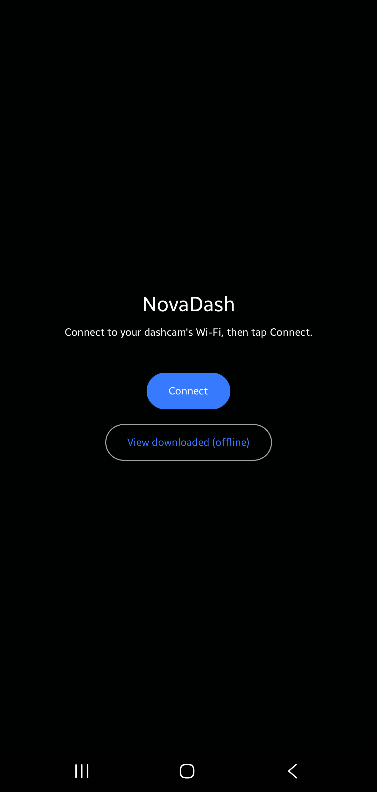
  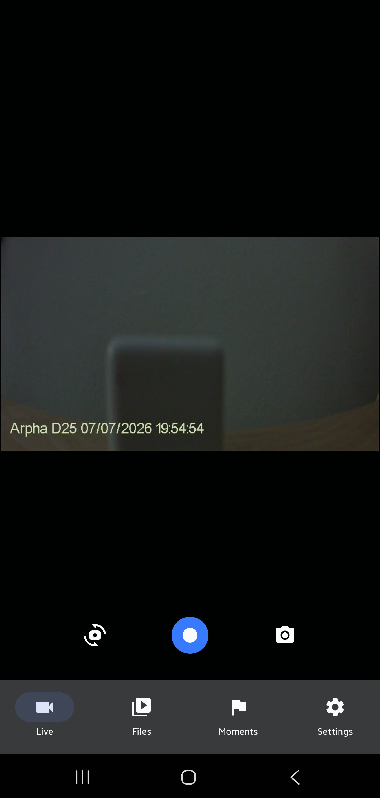
  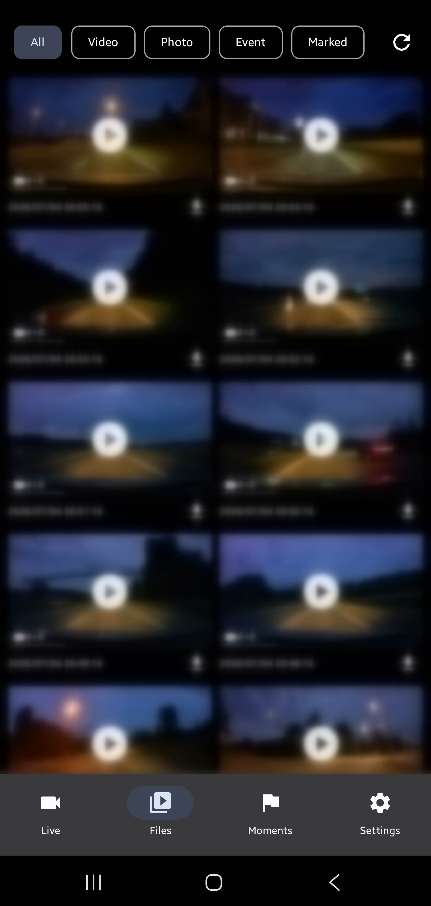
  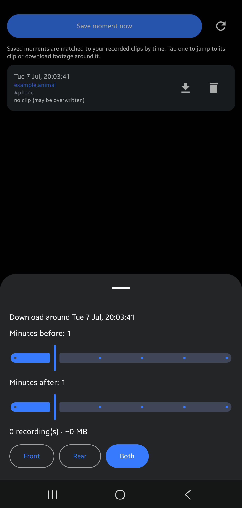
  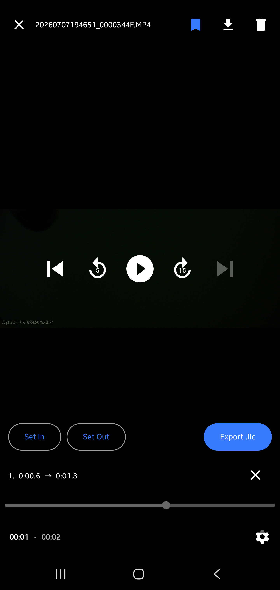
  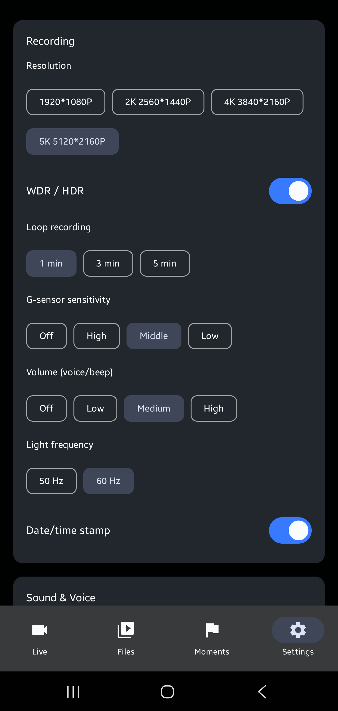
  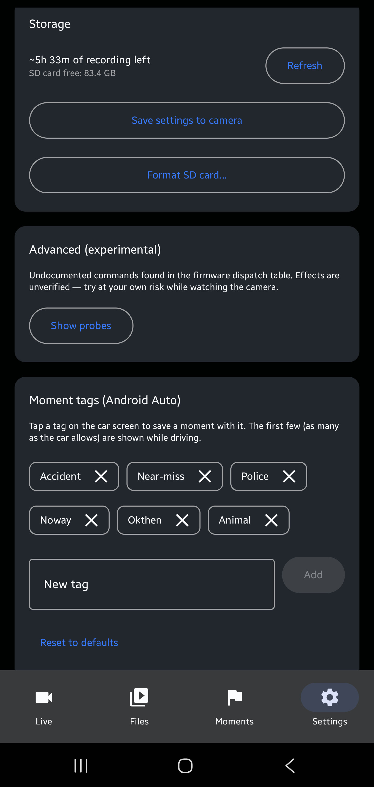
  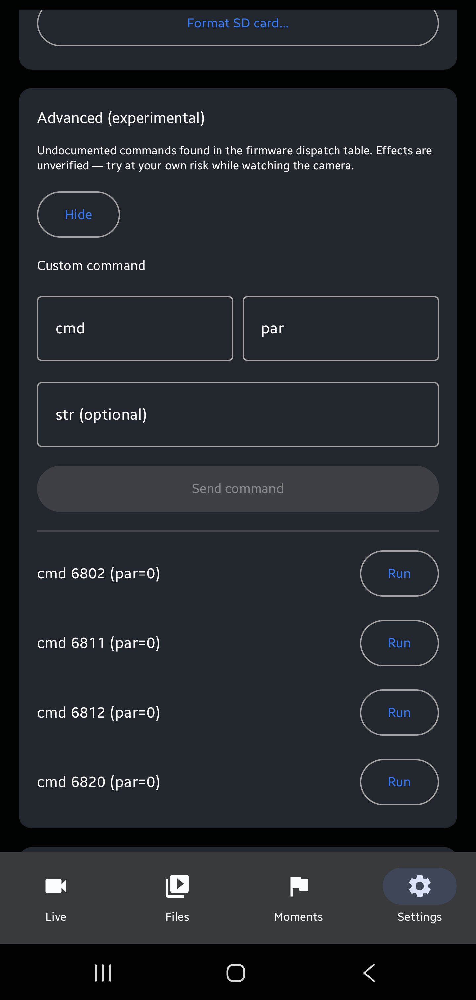
</p>

**Android Auto** — flag a moment while driving, review saved moments, manage tags:

<p align="center">
  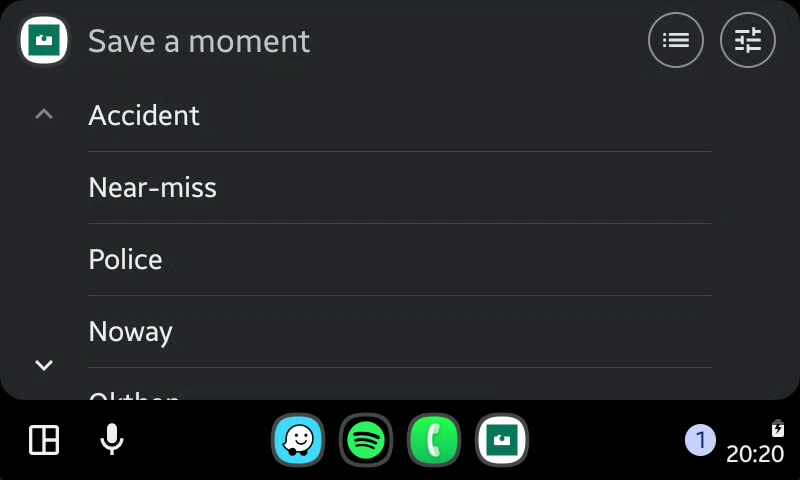
  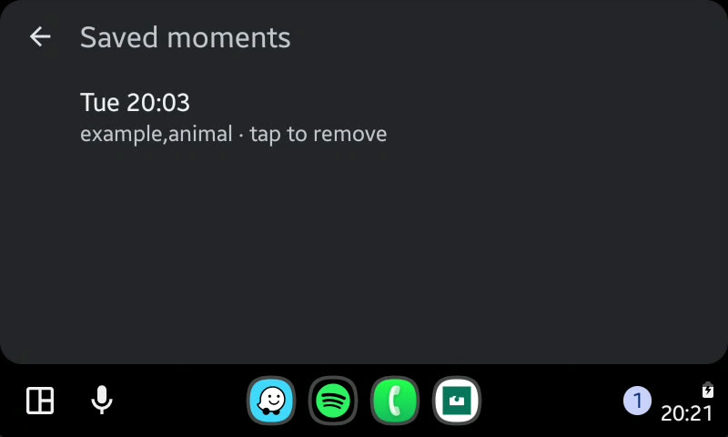
  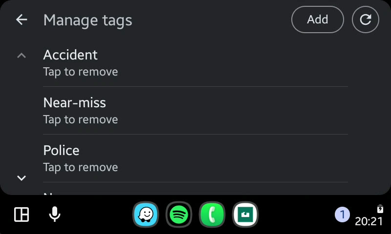
</p>

## Features

- **Live view** — RTSP preview (front/rear, via libVLC), start/stop recording, and take a
  photo (snapshot while recording).
- **Files** — browse SD-card clips and photos with thumbnails; filter by all / video / photo /
  event / marked; download to the phone (front, rear, or both) with a queue, progress and
  speed; delete (from the camera when online, from the phone when offline); play back streamed
  or local with two-axis swipe (up/down = prev/next clip, left/right = front/rear).
- **Markers & export** — set in/out cut points on a clip and export a LosslessCut `.llc`
  project to `Download/NovaDash`.
- **Moments** — flag a moment (time + quick tag), then reconcile it with recorded clips: jump
  to the matching clip and download footage in a ± minutes window. Works on the phone and on
  the **Android Auto** car screen — tap a preset tag to save a moment while driving (tags are
  managed in Settings; moments can also be created on the phone without AA).
- **Settings** — Wi-Fi SSID/password; recording (resolution, WDR/HDR, loop interval, G-sensor,
  volume, date/time stamp, light frequency) — the available options and current values are read
  **live from the camera** (cmd 3030 / 3014), so they reflect what your specific model supports
  rather than a hardcoded list; record-audio toggle and "mute voice & beep"; **SD storage**
  (free space + estimated recording time left); save-to-camera; format SD; and an experimental
  panel to probe undocumented firmware commands.
- **Offline / Online modes** — Online connects to the dashcam Wi-Fi for live control; Offline
  works without the camera, browsing already-downloaded clips and managing moments/tags.

## Protocol

The camera exposes three local transports on its Wi-Fi AP:
- **Control API** — `http://192.168.1.254/?custom=1&cmd=<id>[&par=][&str=]` → XML.
  (`custom=1` must be the **first** query parameter or the server ignores the command.)
- **Live video** — `rtsp://192.168.1.254/liveRTSP/av4` (front; `av5` rear, unverified).
- **Events** — TCP `192.168.1.254:8192`, camera-pushed status notifications.

Command IDs and response schemas were worked out by watching the stock app's Wi-Fi traffic
against a real camera; see `app/src/main/java/com/novadash/net/NovaCommands.kt`.

## Install

For the **Android Auto** integration to work in a real car, install NovaDash **from Google
Play** (currently distributed via the internal-testing track) — Android Auto only shows car
apps that were installed from the Play Store. A sideloaded/debug build still works fine on the
phone and on the Desktop Head Unit (DHU) emulator, but don't count on it in a real car: the
**Unknown sources** toggle in Android Auto's developer settings is meant to allow non-Play
apps, yet sideloaded car apps often still fail to appear on the head-unit launcher.

## Build

```sh
./gradlew :app:installDebug        # build + install to a connected device
./gradlew :app:testDebugUnitTest   # unit tests
```

Requires the Android SDK (platform 35) and JDK 17. Stack: Kotlin 2.0, Compose (Material 3),
Hilt, Retrofit/OkHttp + Simple-XML, libVLC (RTSP), media3 (local playback), Coil,
androidx.car.app. min SDK 24 / target 35.

## Bonus: custom camera sounds (firmware mod)

The camera's prompt sounds (button click, "recording started", emergency, boot, etc.) are raw
16 kHz / 16-bit / mono PCM baked into its `/usr/bin/cardv` binary — no Wi-Fi command exposes
them. They **can** be replaced by patching that binary over the camera's root shell (telnet,
login `root`, no password) and rebooting.

This is **separate from the app** and **specific to one firmware build** — the byte offsets are
hardcoded, so applying them to a different version would corrupt `cardv` and brick the camera.
It's a manual, at-your-own-risk procedure, but fully reversible via a backup of the original
binary. On the reference camera (ARPHA D25, `V0.0.6-20230816`) the button click, "recording
started" (which is the de-facto power-on sound), and the emergency-clip sound were swapped for
custom clips. The full method, scripts, and rollback command are in
[`firmware-sound-mod/`](firmware-sound-mod/) (scripts + howto only — the proprietary firmware
binary and the audio clips are not included; bring your own).

## Notes / TODO

- Command IDs and error codes build on
  [nutsey/novatek-web-api-commands](https://github.com/nutsey/novatek-web-api-commands),
  verified and extended against a real ARPHA D25 (firmware `Arpha-D25--V0.0.6-20230816TE`).
- **GPS export** from clips isn't in-app yet. For now, extract on a PC with
  `exiftool -ee -G3 -s -api LargeFileSupport=1 file.mp4` — the camera stores Novatek `freeGPS`
  binary blocks (XOR-obfuscated), not standard NMEA.
- Rear-camera RTSP stream name (`av5`) is a guess (no rear camera on hand to verify).
